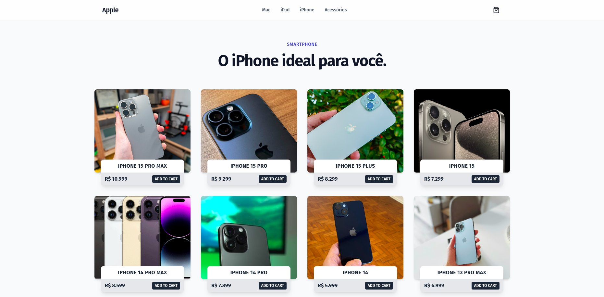

# 🍎 Apple Store - E-commerce Inspirado na Apple

[](https://react.dev/) [](https://www.typescriptlang.org/) [](https://vite.dev/) [](https://tailwindcss.com/)

Uma aplicação web moderna e responsiva de e-commerce inspirada no design minimalista e elegante da Apple, desenvolvida com **React + TypeScript + Vite** e estilizada com **Tailwind CSS**.

> 🎓 **Nota:** Este projeto foi desenvolvido para consolidar conhecimentos em desenvolvimento frontend moderno, focando em performance, animações fluidas e experiência do usuário premium.

## 📸 Preview


*Página inicial com hero section e categorias de produtos*



*Catálogo de produtos com animações e efeitos hover*

---

## ✨ Funcionalidades do Projeto

* **🛒 Carrinho de Compras Global:** Sistema de carrinho completo com Context API, permitindo adicionar/remover produtos de qualquer página.
* **🎨 Design Premium:** Interface inspirada na Apple com animações suaves usando Framer Motion.
* **📱 Totalmente Responsivo:** Layout adaptável para desktop, tablet e mobile.
* **⚡ Lazy Loading:** Carregamento otimizado de componentes e páginas para melhor performance.
* **🔔 Notificações Toast:** Feedback visual elegante usando Sonner para ações do usuário.
* **🎭 Animações Fluidas:** Transições de página e micro-interações com Framer Motion.
* **🚀 SPA com Roteamento:** Navegação sem recarregamento usando React Router DOM.
* **🎯 Loading Screen:** Tela de carregamento inicial personalizada para melhor UX.

---

## 🛠 Tecnologias e Conceitos Aplicados

| Tecnologia | Descrição |
| :--- | :--- |
| **React 19** | Biblioteca JavaScript para construção de interfaces de usuário modernas. |
| **TypeScript** | Superset do JavaScript que adiciona tipagem estática ao código. |
| **Vite** | Build tool extremamente rápida para desenvolvimento frontend. |
| **Tailwind CSS** | Framework CSS utility-first para estilização rápida e consistente. |
| **Framer Motion** | Biblioteca de animações declarativas para React. |
| **React Router DOM** | Roteamento declarativo para aplicações React SPA. |
| **Context API** | Gerenciamento de estado global para o carrinho de compras. |
| **Lazy Loading** | Carregamento sob demanda de componentes para otimização. |
| **Sonner** | Sistema de notificações toast elegante e acessível. |
| **Lucide React** | Biblioteca de ícones SVG modernos e customizáveis. |

---

## 🔧 Pré-requisitos

Antes de começar, certifique-se de ter instalado em sua máquina:

* **Node.js 18+** (recomendado: versão LTS)
* **npm** ou **yarn**
* **Git**

---

## 🚀 Como Executar

1. **Clone o repositório:**

   ```bash
   git clone https://github.com/seu-usuario/ProjetoApple.git
   cd ProjetoApple
   ```

2. **Instale as dependências:**

   ```bash
   npm install
   ```

3. **Execute o servidor de desenvolvimento:**

   ```bash
   npm run dev
   ```

4. **Acesse no navegador:**

   Abra [http://localhost:5173](http://localhost:5173) para visualizar a aplicação.

---

## 📦 Scripts Disponíveis

| Comando | Descrição |
| :--- | :--- |
| `npm run dev` | Inicia o servidor de desenvolvimento com hot reload |
| `npm run build` | Compila o TypeScript e cria o build de produção |
| `npm run preview` | Visualiza o build de produção localmente |
| `npm run lint` | Executa o ESLint para verificar problemas no código |

---

## 🧱 Estrutura do Projeto

```
src/
├── components/           # Componentes reutilizáveis
│   ├── Header.tsx       # Cabeçalho com navegação e carrinho
│   ├── Hero.tsx         # Seção hero da página inicial
│   ├── CartDrawer.tsx   # Drawer lateral do carrinho
│   ├── ProductCard.tsx  # Card de produto
│   ├── CategoryCard.tsx # Card de categoria
│   ├── LoadingScreen.tsx # Tela de loading inicial
│   ├── LoadingSpinner.tsx # Spinner de carregamento
│   └── ...
├── pages/               # Páginas da aplicação
│   ├── Mac.tsx         # Página de produtos Mac
│   ├── Iphone.tsx      # Página de produtos iPhone
│   ├── Ipad.tsx        # Página de produtos iPad
│   └── Acessorios.tsx  # Página de acessórios
├── context/            # Context API
│   └── CartContext.tsx # Contexto global do carrinho
├── data/               # Dados mockados dos produtos
│   ├── macs.ts
│   ├── ipads.ts
│   └── products.ts
├── utils/              # Funções utilitárias
├── App.tsx             # Componente principal com rotas
├── main.tsx            # Entry point da aplicação
└── index.css           # Estilos globais e configuração Tailwind
```

---

## 💡 Destaque de Código

### Context API - Gerenciamento do Carrinho

O `CartContext` gerencia todo o estado do carrinho de forma global e eficiente:

```typescript
export const CartProvider = ({ children }: { children: React.ReactNode }) => {
  const [isOpen, setIsOpen] = useState(false);
  const [items, setItems] = useState<CartItem[]>([]);

  const addItem = (product: Product) => {
    setItems(prev => {
      const existing = prev.find(item => item.id === product.id);
      if (existing) {
        return prev.map(item =>
          item.id === product.id
            ? { ...item, quantity: item.quantity + 1 }
            : item
        );
      }
      return [...prev, { ...product, quantity: 1 }];
    });
    toast.success('Produto adicionado ao carrinho!');
  };

  // ... outras funções
};
```

### Lazy Loading para Performance

Componentes e páginas são carregados sob demanda para otimizar o tempo de carregamento inicial:

```typescript
const Mac = lazy(() => import('./pages/Mac'));
const Iphone = lazy(() => import('./pages/Iphone'));
const Ipad = lazy(() => import('./pages/Ipad'));

// Uso com Suspense
<Suspense fallback={<LoadingSpinner />}>
  <Mac />
</Suspense>
```

### Animações com Framer Motion

Transições suaves entre páginas e micro-interações:

```typescript
<motion.div
  initial={{ opacity: 0, y: 20 }}
  animate={{ opacity: 1, y: 0 }}
  exit={{ opacity: 0, y: -20 }}
  transition={{ duration: 0.3 }}
>
  {/* Conteúdo */}
</motion.div>
```

---

## 🎨 Características de Design

* **Paleta de Cores:** Inspirada no design system da Apple (branco, cinza, preto e azul).
* **Tipografia:** Fontes system-ui para máxima legibilidade e performance.
* **Espaçamento:** Grid system consistente com Tailwind CSS.
* **Animações:** Micro-interações suaves para melhor feedback visual.
* **Responsividade:** Mobile-first approach com breakpoints bem definidos.

---

## 🔮 Próximas Funcionalidades

- [ ] Integração com API backend real
- [ ] Sistema de autenticação de usuários
- [ ] Página de checkout completa
- [ ] Filtros e busca de produtos
- [ ] Wishlist (lista de desejos)
- [ ] Comparação de produtos
- [ ] Reviews e avaliações
- [ ] Modo escuro (dark mode)


## 👨‍💻 Autor

Desenvolvido por [Emerson Sinezio](https://github.com/EmersonSinezio)

---

**⭐ Se este projeto foi útil para você, considere dar uma estrela no repositório!**
