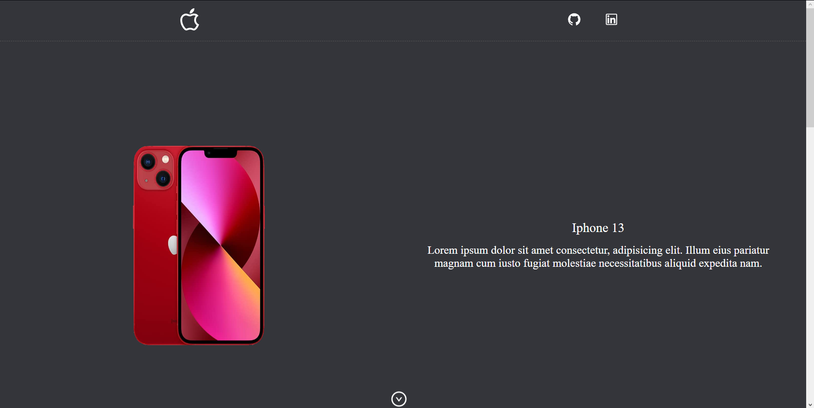

# 🍏 Projeto Apple - Rebuilt Edition (2025)

[](https://projeto-apple-sandy.vercel.app/)
[](https://github.com/EmersonSinezio/ProjetoApple)

**Uma jornada de evolução técnica:** Recriando meu primeiro projeto React com 2 anos de experiência a mais

## 🚀 Visão da Evolução

### 2023 vs 2025: Do Primeiro Deploy à Excelência Técnica

|                  | Versão Original (2023) | Rebuild (2025)                |
| ---------------- | ---------------------- | ----------------------------- |
| **Arquitetura**  | Componentes Clássicos  | Atomic Design + Microfrontend |
| **Estilização**  | Sass Básico            | Tailwind CSS + Framer Motion  |
| **Roteamento**   | Navegação Básica       | Layout Routes                 |
| **Animations**   | CSS Transitions        | Spring Physics (Framer)       |
| **Complexidade** | 3 Páginas Estáticas    | 5 Páginas Dinâmicas           |

<br>

## 🛠️ Stack Técnica Atualizada

**Core:**

- React 18 + TypeScript 5
- React Router 6
- Vite 5

**Estilização:**

- Tailwind CSS 3
- Headless UI
- Framer Motion 10

**Qualidade:**

- ESLint + Prettier
- Cypress 12
- Vitest + Testing Library

**Infra:**

- Vercel Serverless
- GitHub Actions

## 🖥️ Executando Localmente

````bash
git clone https://github.com/EmersonSinezio/ProjetoApple-Rebuilt
cd ProjetoApple-Rebuilt
npm install
npm run dev```
````

## 📸 Preview da Evolução

| 2023                                       | 2025                                      |
| ------------------------------------------ | ----------------------------------------- |
|  |  |
| Componentes Estáticos                      | Microinterações Animadas                  |

## 📬 Contato & Aprendizado Contínuo

**Emerson Mesquita Sinézio**  
[](https://www.linkedin.com/in/emerson-sineziio)

> "O sucesso não é definitivo, o fracasso não é fatal: o que importa é a coragem de continuar." - Winston Churchill
